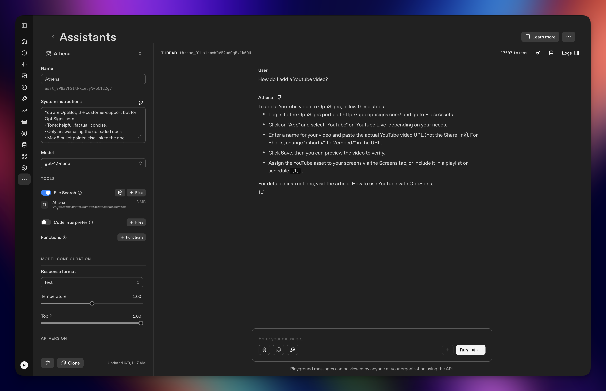

# Athena — OptiBot Mini-Clone

A backend ingestion pipeline for an OptiBot Mini-Clone. It fetches public OptiSigns support articles, converts them into
clean Markdown files, uploads changed documents to an OpenAI Vector Store via API, and runs as a scheduled daily sync
job on DigitalOcean Platform.

## Features

- Fetches articles from `support.optisigns.com`
- Converts HTML to clean Markdown
- Detects added, updated, and unchanged articles using SHA256 hashes
- Uploads only changed files to an OpenAI Vector Store
- Logs sync results (`added`, `updated`, `skipped`, `failed`, `uploaded_files`, `total_estimated_chunks`)

## Setup

```bash
cp .env.sample .env
python -m venv .venv
source .venv/bin/activate
pip install -e .
```

Required environment variables:

```env
OPENAI_API_KEY=
OPENAI_VECTOR_STORE_ID=

SUPPORT_BASE_URL="https://support.optisigns.com"
ZENDESK_LOCALE="en-us"
MAX_ARTICLES=50
DATA_DIR="data/articles"

STATE_BACKEND="file" # Either "file" or "gist"
STATE_PATH="data/state.json"
LAST_RUN_PATH="data/last-run.json"

# Required only when STATE_BACKEND="gist"
GITHUB_GIST_TOKEN=
GITHUB_GIST_ID=
GITHUB_GIST_STATE_FILENAME="state.json"
GITHUB_GIST_LAST_RUN_FILENAME="last-run.json"

DRY_RUN=true
DELETE_STALE_VECTOR_FILES=true
```

## Run locally

Run the full sync pipeline:

```bash
python src/main.py
```

Run without calling OpenAI API:

```bash
DRY_RUN=true python src/main.py
```

## Run with Docker:

```bash
docker build -t athena .
docker run --env-file .env athena
```

## Delta detection

Each article is converted into Markdown and hashed using SHA256. The sync state stores the article ID, title, URL,
updated timestamp, content hash, local Markdown path, OpenAI file ID, and Vector Store file ID. On each run:

* New article → `added`
* Changed hash → `updated`
* Unchanged hash → `skipped`

This avoids re-uploading identical documents.

## Chunking strategy

Each support article is stored as a single Markdown file with metadata (including `Article URL`) so the assistant can
cite the original source. OpenAI Vector Store built-in chunking is used for retrieval.

## Daily job logs / last run artifact

The scheduled DigitalOcean job writes normal runtime logs to DigitalOcean App Platform. Since DigitalOcean deploy logs
are not always publicly shareable, the pipeline also writes a sanitized `last-run.json` artifact.

- For local backend: `data/last-run.json`
- For deployment backend: `last-run.json` in the configured GitHub Gist

The artifact includes `added`, `updated`, `skipped`, `failed`, `uploaded_files`, and `total_estimated_chunks`.

Here is [the link to lastest run artifact](https://gist.github.com/minami22x3/df717274809d8b49d1571e51c509ea9e).

## Playground validation

Question used for validation:

```txt
How do I add a YouTube video?
```

The assistant answered using the uploaded documentation and included the corresponding `Article URL` citation.



